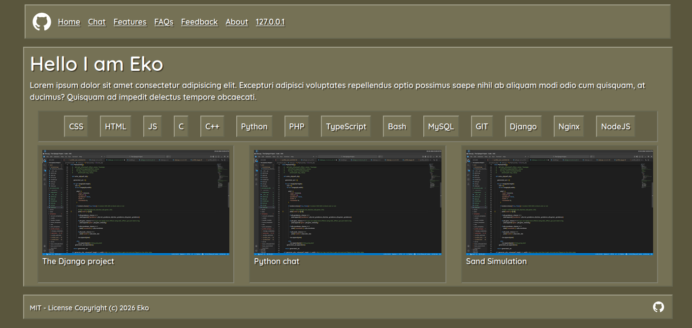
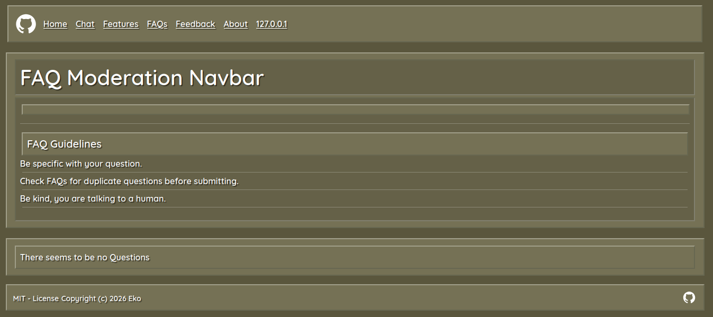

<h1>A portfolio site designed with django</h1>

<p>This is a portfolio site designed with Django, there are features other than being a portfolio site, that will expand as time goes on.</p>

<hr>



<small style="color:gray">These images may not represent the project at its current state and may look outdated. As the project develops</small>

<hr>

<h3>Features</h3>

<ul>
    <hr class="m-1">
    <li>FAQ system</li>
    <hr class="m-1">
    <li>Feedback system</li>
    <hr class="m-1">
    <li>a IP address based authenticating system <a>(In Progress)</a></li>
    <hr class="m-1">
    <li style="color:gray">A very simple chatting node js server (will be reworked with my own implementation)</li> 
</ul>

<hr>



<small style="color:gray">These images may not represent the project at its current state and may look outdated. As the project develops</small>

<hr>

<h3>Project Architecture</h3>

```
adapters/
    persistance/
        models.py

core/
    entities/
        entities.py

framework/
    nodeapp/
        # All nodeJS applications
    webapp/
        # All django applications
    porfolio/
        settings.py
    
use_cases/
    use_cases.py
    interface.py

```
<p>Currently i am trying to rework the project from a monolith architecture to a clean onion architecture.</p>
<p>Refrence project i used to guide myself https://github.com/brunodantas/onion-tasks</p>
<hr>

<h3>Road map</h3>

<p>The current project is very new and in development, this section will be completed soon.</p>

<hr>

<h3>Why?</h3>

<p>The portfolio site isnt just for me, the entire project is for me to get better at these skills. While also creating modular apps to use anywhere i would like.</p>

<hr>

<h3>Contributing Guidelines</h3>

<h4>1. Creating an issue</h4>
<p>If you find a bug or something bothering you, i recommend you tell us by creating a issue. This is the most likely way you will be able to contact and comunicate with me as i look at the issues alot.</p>

<h4>2. Contributing</h4>
<p>I do not have any strict rules on contributing, feel free to create a PR about any features (new frameworks, systems etc.). and bugs. Though i do not condone the usage of AI, if the PR looks like its all created by AI i will most likely not accept it for this project unless its a minor change.</p>

<h3>Where can i find a live server?</h3>
Currently i do not have a production server running this project.
